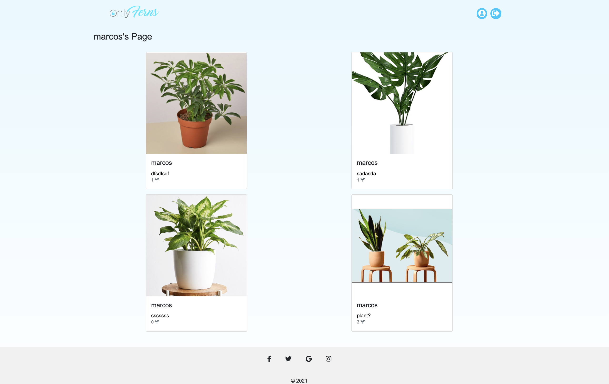
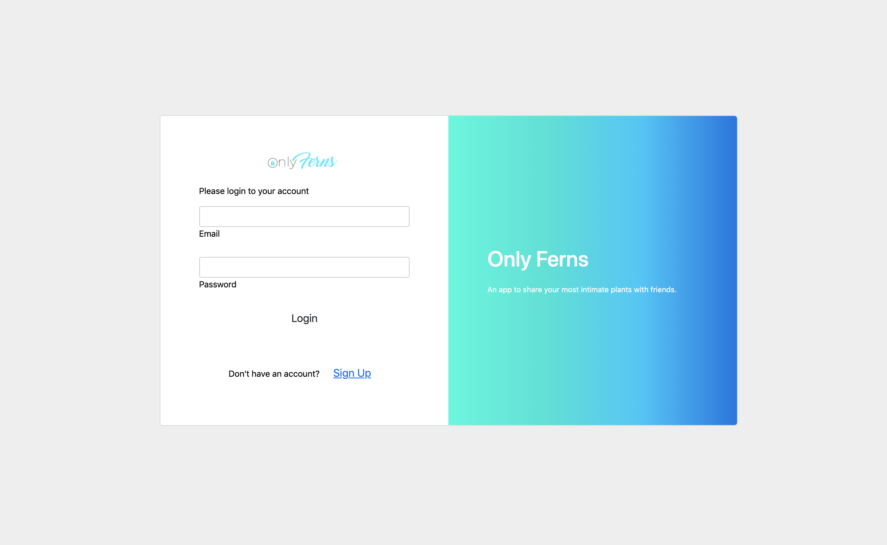

# Only-Ferns Full Stack Applicationn2

# Description: 

Created a web application that allows users to sign-up or login to an account. It allows users to view a feed of all user's posts. Users can add their own photos, but it must be of a plant. The microsoft AI scans the photo that is uploaded to make sure it's a plant. Users can like and comment on posts. 

# Tech Used:

 HTML, CSS, JS, API, JSON, NODE.JS, EXPRESS, MONGODB, USER AUTH, MICROSOFT AI